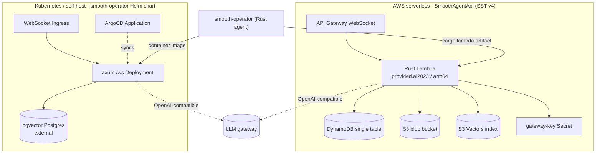
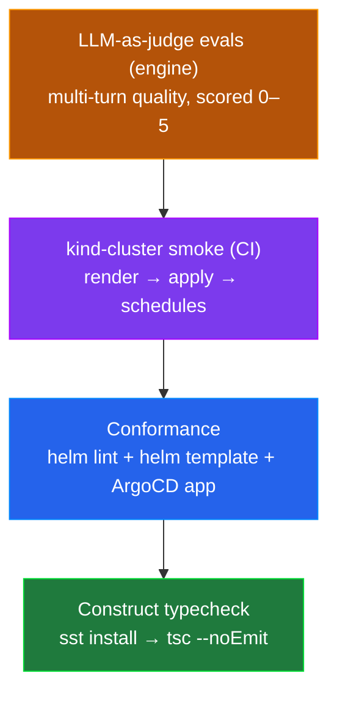

<p align="center">
  
</p>

<p align="center">
  <strong>Deploy a smooth-operator agent two ways, from one package.</strong><br/>
  Reusable SST v4 constructs for AWS serverless, and a Helm chart + ArgoCD for Kubernetes — the shared deploy primitives behind smooth-operator, dogfooded by smooai.
</p>

<p align="center">
  <a href="./LICENSE"></a>
  
  
  
  <a href="https://lom.smoo.ai"></a>
</p>

---

`@smooai/deploy` packages the **deploy primitives** for a [smooth-operator](https://github.com/SmooAI/smooth-operator)-style agent so you don't hand-roll them per service. It gives you two production-shaped paths off the same conventions:

- **AWS serverless** — `new SmoothAgentApi(...)`: an API Gateway WebSocket + (Rust) Lambda + DynamoDB single table + S3 blob bucket + S3 Vectors wiring + gateway-key secret + IAM links, as a single parameterized SST component.
- **Kubernetes / self-host** — the `smooth-operator` Helm chart: an axum `/ws` server backed by pgvector Postgres, fronted by a WebSocket-friendly Ingress, synced by ArgoCD.

Two real consumers justify the shared package: **smooth-operator** (the reference WebSocket agent service, uses both surfaces today) and the **smooai monorepo** (dogfoods the SST constructs piecemeal).

---

## Quickstart

### AWS serverless — one construct in your `sst.config.ts`

```ts
// consumer's sst.config.ts — inside run()
import { SmoothAgentApi } from '@smooai/deploy';

const agent = new SmoothAgentApi('SmoothAgent', {
  // The cargo-lambda output dir holding `bootstrap` (provided.al2023 / arm64).
  artifactDir: '../../rust/target/lambda/smooai-smooth-operator-lambda',
  model: 'claude-haiku-4-5',
});

return agent.outputs; // { api, table, blobs, vectorBucket }
```

One `new SmoothAgentApi(...)` stands up the whole serverless backend and wires the IAM links between the pieces. The smaller building blocks — `WebSocketLambdaApi`, `DynamoSingleTable` — are exported too, so you can adopt them independently.

> These are **SST constructs**, not a deployable app. They reference SST's ambient `$`-globals (`sst.aws.*`, `$interpolate`, `$app`), so import them from inside an SST app's `run()`.

### Kubernetes — one `helm install`

```bash
helm upgrade --install smooth-operator helm/smooth-operator \
  --namespace smooai-smooth-operator --create-namespace \
  --set image.tag=0.1.0 \
  --set gateway.keySecretRef.name=smooth-operator-gateway \
  --set database.urlSecretRef.name=smooth-operator-db
```

> Postgres with the **pgvector** extension is an external dependency (the chart does not vendor a Postgres pod). Point `database.urlSecretRef` at a pgvector-enabled database — see [`helm/smooth-operator/README.md`](helm/smooth-operator/README.md).

---

## Showcase: compose the smaller primitives

`SmoothAgentApi` is the batteries-included path. When you want to assemble your own topology, the sub-constructs are first-class:

```ts
import { WebSocketLambdaApi, DynamoSingleTable } from '@smooai/deploy';

// A DynamoDB single table (OLTP + checkpoints + connection registry).
const table = DynamoSingleTable('AgentTable', {});

// An API Gateway WebSocket fronting a Rust Lambda, with your own routes.
const { api } = WebSocketLambdaApi('AgentApi', {
  handler: '../../rust/target/lambda/my-agent-lambda',
  environment: { SMOOTH_AGENT_DDB_TABLE: table.name },
  link: [table],
  // Defaults to the SmooAI protocol routes; override as needed:
  // routes: [{ route: 'send_message', timeout: '30 seconds' }, …],
});
```

Defaults are sensible: the WebSocket route table covers `$connect`, `$disconnect`, `send_message`, `ping`, and `$default`; the gateway URL defaults to `https://llm.smoo.ai/v1`; the model defaults to `claude-haiku-4-5`.

---

## Why this

| You want… | @smooai/deploy gives you |
| --- | --- |
| **One construct**, whole serverless backend | `SmoothAgentApi`: WS API + Lambda + Dynamo + S3 + Vectors + secret + IAM |
| **Composable** primitives | `WebSocketLambdaApi`, `DynamoSingleTable` exported independently |
| **A Kubernetes path too** | the `smooth-operator` Helm chart + ArgoCD `Application` |
| **No copy-paste between services** | the smooth-operator deploy logic, extracted and parameterized |
| **Safe-by-default pods** | non-root, read-only rootfs, dropped caps, seccomp `RuntimeDefault` |
| **WebSocket-aware Ingress** | long proxy timeouts + websocket annotations baked into chart defaults |

---

## Architecture — one agent, two deploy paths



The same agent ships as a Lambda artifact (serverless) or a container image (k8s). Both speak the same WebSocket protocol and call the same OpenAI-compatible LLM gateway — you pick the runtime, not the agent.

---

## Test-driven by default — verified, not vibe-coded

Infra you can't `cargo test` still has to be **verified, not vibe-coded**. This package proves correctness without a live AWS account or cluster:

- **SST constructs** typecheck against real SST platform types: `pnpm sst install` generates `.sst/platform`, then `tsc --noEmit` validates the constructs compile against the SDK surface — catching the SST footguns (unlinked resources, ambient-global misuse) that only `next build`-class checks surface.
- **Helm chart** is linted and rendered: `helm lint` + `helm template` validate the chart and ArgoCD `Application` produce valid manifests.
- **kind-cluster smoke** (CI): the rendered chart is applied to an ephemeral `kind` cluster so the manifests actually schedule.
- **Deployed via CI, never locally** — local deploys can ship unintended changes; the pipeline owns `sst deploy` / `argocd sync`.



Verify locally (no AWS creds, no deploy):

```bash
# SST constructs
cd sst && pnpm install && pnpm sst install && npx tsc --noEmit

# Helm chart
helm lint helm/smooth-operator
helm template smooth-operator helm/smooth-operator
```

> The full quality pyramid spans repos: the engine's **408 unit tests + LLM-as-judge evals** (which caught a multi-turn defect that scored 1/5 → fixed → 5/5) and the widget's **live Playwright e2e** sit above this package's static + smoke verification.

---

## Constructs reference

| Export | What it is |
| --- | --- |
| `SmoothAgentApi` | The full serverless backend (WS API + Lambda + Dynamo + S3 + Vectors + secret + IAM). |
| `WebSocketLambdaApi` | API Gateway WebSocket fronting a Rust Lambda, with a configurable route table. |
| `DynamoSingleTable` | The single-table Dynamo schema (OLTP + checkpoints + connection registry). |

### `SmoothAgentApi` args (selected)

| Arg | Default | Purpose |
| --- | --- | --- |
| `artifactDir` | *(required)* | The `cargo lambda` output dir holding `bootstrap`. |
| `model` | `claude-haiku-4-5` | Model id requested from the gateway. |
| `gatewayUrl` | `https://llm.smoo.ai/v1` | OpenAI-compatible LLM gateway base URL. |
| `maxIterations` | `6` | Agent-loop iteration cap per turn. |
| `maxTokens` | `512` | `max_tokens` sent to the gateway. |
| `routes` | SmooAI protocol routes | Override the WebSocket route table. |

> **The S3 Vectors gap:** SST v4 ships no native S3 Vectors component (the service went GA 2025-12). `SmoothAgentApi` declares the intended bucket/index names, wires them into the Lambda env, and grants `s3vectors:*` — but does not create the vector bucket/index as a first-class resource by default. Provision it out-of-band per the README until your AWS provider exposes `aws.s3vectors.*`.

---

## Helm chart (`smooth-operator`)

```bash
helm lint helm/smooth-operator
helm template smooth-operator helm/smooth-operator
```

- **pgvector Postgres** is external (`postgres.external: true`) — point `database.urlSecretRef` at a pgvector-enabled database (`pgvector/pgvector:pg16`, CloudNativePG, RDS with pgvector).
- **Secrets** wire via `gateway.keySecretRef` / `database.urlSecretRef` (reference existing secrets — e.g. external-secrets-operator — in prod; inline values are dev-only).
- **WebSocket Ingress** ships with long proxy timeouts + websocket annotations (nginx defaults; ALB notes in the chart README).
- **Hardened pods**: non-root, read-only rootfs, dropped capabilities, seccomp `RuntimeDefault`.

See [`helm/smooth-operator/README.md`](helm/smooth-operator/README.md) for the pgvector requirement, secret wiring, Ingress notes, and ArgoCD.

---

## Smoo-powered or bring-your-own

**Bring-your-own:** deploy into *your* AWS account (SST) or *your* cluster (Helm/ArgoCD). Point the gateway URL at any OpenAI-compatible endpoint, bring your own pgvector Postgres or provision the S3 Vectors index yourself. You own the infra end to end.

**Smoo-powered:** point the gateway at `https://llm.smoo.ai/v1` for unified billing + model routing, or skip the deploy entirely and let [**lom.smoo.ai**](https://lom.smoo.ai) run the smooth-operator service for you.

---

## Publishing follow-up

`@smooai/deploy` is consumed today via a **path dep** (`"@smooai/deploy": "file:../../deploy/sst"`) for local development. The follow-up is to **publish `@smooai/deploy` to npm** (and the chart to an OCI/HTTP Helm repo) so consumers pin a version instead of a sibling-checkout path. See [`docs/Consuming.md`](docs/Consuming.md).

---

## Links

- [**lom.smoo.ai**](https://lom.smoo.ai) — hosted agent service
- [smooth-operator](https://github.com/SmooAI/smooth-operator) — the agent service this deploys
- [smooth-operator-core](https://github.com/SmooAI/smooth-operator-core) — the Rust engine
- [chat-widget](https://github.com/SmooAI/chat-widget) — the embeddable widget
- [smoo.ai](https://smoo.ai) — the product · [github.com/SmooAI](https://github.com/SmooAI) — more open source

## License

[MIT](LICENSE) © Smoo AI.
